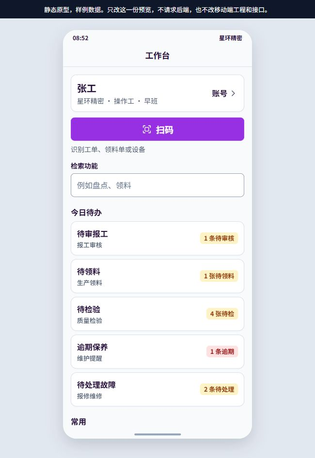
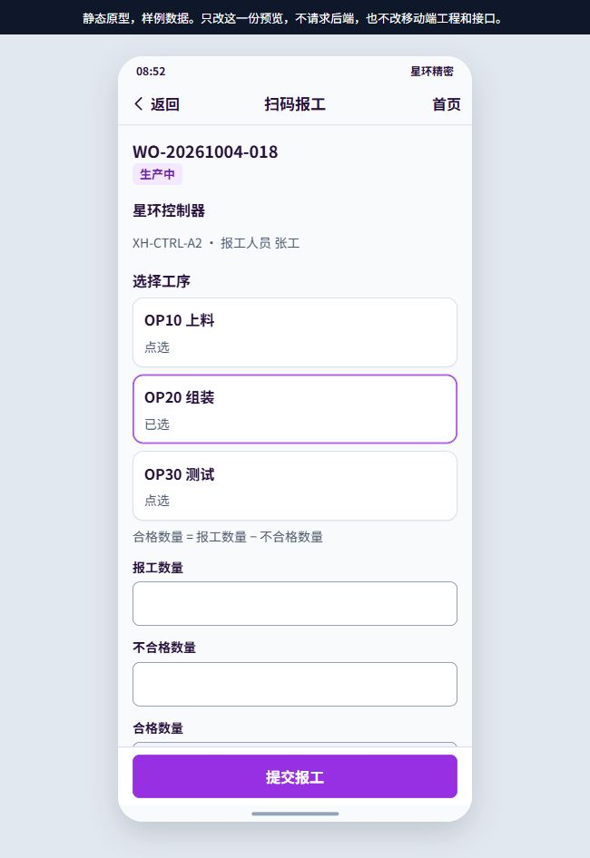
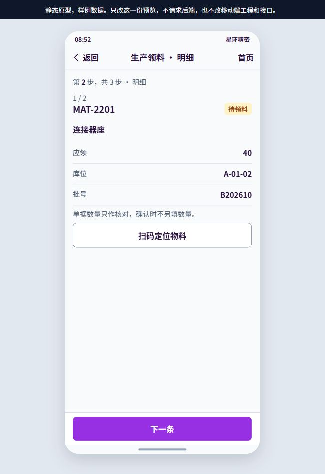

# 移动端产品与 UX 审查（2026-10-05）

审查对象：mobile-static-preview 原型，以及 riveredge-app-mobile 当前工作区源码。先实际浏览原型，再对照正式工程与后端。当前工作区已有未提交改动，本报告依据当前文件，不代表已发布版本。未修改业务代码。

结论：五个业务域已有较广覆盖，当前主要短板是现场操作效率、任务真实性和操作闭环。优先用现有接口优化前端，比继续扩充功能入口更有价值。

## 1. 原型实看记录

按以下顺序访问：登录空提交与组织选择 → 工作台 → 我的工单 → 工单详情 → 报工工序与数量 → 领料列表 → 单据 → 明细核对。登录和组织选择能走通；工单到报工的路径清晰；领料分步核对比正式通用表单更贴近现场。未提交真实业务数据。

三张已保存并重新打开确认的关键截图：

1. 工作台：结构清晰，但五张待办卡把常用操作推到首屏以下；样例待办不能视为后端已支持的统一口径。
2. 报工：工单身份、状态、工序选中态清楚；工序卡展开占据较多高度，数量、工时仍需滚动。
3. 领料明细：单条物料、数量、库位、批号清晰；逐条核对适合小单，多行单需要跳转、定位和已核对进度。

## 2. 正式工程与后端支持矩阵

下表是候选改进及推荐方向，不是已选定的实现方案。存在多个可行落地方式的项目，应按 AGENTS.md 在实施前交用户选定。

| 优先级 | 已读代码中的短板与影响 | 推荐方向 | 后端影响 / 证据 |
|---|---|---|---|
| P0 | 首页把各 scope 请求错误放入 WorkScope.errorText、角标错误放入 badgeNote，但首页 applyHome 不呈现这两者。故障、保养数量未知时，可能出现“今天没有待办”。 | 区分加载中、读取失败、确实为零，给失败分区重试。首页不应在只覆盖两类任务时宣告全部工作为空。 | 纯前端；shell/workbench/load.uts 与 index.uvue。 |
| P0 | 报工审核只有工单/工序、人员、报工总量和状态，点击“审核”立即 POST；没有提交锁。审核者难以核对不合格量、工时等依据，连点可能重复请求。 | 补足已有记录的审核摘要，增加明确确认及逐条请求锁，成功后移除或更新记录。 | 纯前端；features/workshop/reporting-approve/index.uvue，已有 GET /reporting 与 POST /reporting/{id}/approve。驳回另需核实，不假设已有。 |
| P1 | 首页扫码提示识别工单、领料单或设备，实际 scanRoute 来自 scan-report，进入的页面只调用 work-orders/resolve-by-scan。 | 先让按钮名称、提示与实际扫码范围一致。统一识码分流可作为后续候选，需逐类核实码格式与解析接口。 | 提示修正纯前端；真正通用扫描尚不能宣称无需后端。 |
| P1 | 普通 H5 无 wx 时扫码直接报“当前页面没有企业微信扫码”，报工页没有手输编码入口。 | 为不支持扫码或扫码失败的场景提供手输/粘贴编码，并复用已有解析请求；入口给出当前渠道能力说明。 | 前端可复用 POST work-orders/resolve-by-scan 的 raw 字段；shared/channel/h5/index.uts 与 scan-report/index.uvue。实际码种仍需联调。 |
| P1 | 首页常用固定为我的工单、异常提报、装箱、我的报工；仓管、质检、设备人员即使有权限，也难获得适合自己的首屏。五个 scope 逐次 await 导航加载。 | 使用已有权限过滤导航，结合本地常用/最近使用形成个人入口。评估复用 /mobile/home 或 scope=home，减少顺序请求。 | 已有 GET /mobile/home 和 GET /mobile/workbench?scope=home；routes_mobile.py、mobile_home_service.py。改造时仍须本地 registry 和平台能力过滤。 |
| P1 | 正式“我的工单”没有搜索、状态筛选、刷新与分页；默认请求只带 assigned_worker_id。全部工单页甚至只展示列表卡片。原型的查找和详情路径尚未全部落地。 | 补关键词、状态、加载更多；保留返回时筛选与滚动位置。详情展示已有信息，连到可执行动作。 | 后端 list_work_orders 已支持 keyword、status、skip、limit、order_by、assigned_worker_id，无需新增接口。 |
| P1 | 报工字段仅 placeholder，没有持续标签和数字键盘配置；parseFloat 可吞掉非法后缀，前端未显式拒绝负数量/负工时。提交成功只有 toast 并清空表单。 | 持续标签、数字键盘、完整数字校验和字段旁错误；显示提交结果摘要，保留明确的下一步。切换工单时明确数量是否保留，避免带错。 | 纯前端，提交字段仍沿用 POST /reporting/quick；scan-report/index.uvue。业务数值边界以既有后端规则为准。 |
| P1 | 设备点检需手输设备 ID/方案 ID/点检人 ID，故障提报需设备 UUID，路线巡检需路线 ID。现场人员需要知道内部标识。 | 扫码带入设备，显示名称；方案按绑定或搜索选择，提交原 ID。人员选择与默认值要遵守现有业务规则。 | 已核实设备解析、equipment-scheme-bindings、equipment-inspection-schemes、equipment-patrol-routes。主要可前端实现，但操作人员的查询权限与绑定适用性需联调，不扩大权限。 |
| P1 | 仓储 board 三步结构已有，但每行平铺仓库、库位、批次、逗号分隔序列号；定位是文本查找，确认页只回显物料和数量。 | 单据已有信息先作核对，修改按需展开；序列号用逐个增删的列表表示，再转回现有数组；确认页补齐将提交的库位、批次、序列号。多行单兼顾逐条与快速定位。 | 前端表单调整可沿用 payload.uts 的 item_id、location_code、batch_number、serial_numbers 等字段。不改变“领料确认不另填实领数量”的当前契约。新增部分领料另行验证。 |
| P1 | 质量 inspection-board 把执行表单放在所有列表项之后，打开时列表仍保留；多步骤、照片、自定义字段都在长表单。取消直接关闭。 | 独立执行视图或覆盖列表，分段显示进度，定位缺失项；附件给缩略图与状态；离开未提交表单时防丢失。 | 主要纯前端。现有代码已读取步骤类型、选项、不适用、照片规则并提交，不需另建质检模型。服务器判定规则保持。 |
| P2 | 原型使用语义 SVG，正式工作台 icons.uts 把图标转成“扫、人、单、列、核”等单字；不同业务难快速辨认。正式组件混用 button、可点击 view 和 text。 | 沿用现有紫色强调、浅底与卡片体系，统一语义图标和控件状态，补可访问名称与选中状态。 | 纯前端；不因此升级框架或引入新 UI 栈。跨 uni-app x 平台兼容须实机验证。 |
| P2 | 模具保养/维修/归还可搜索或选择实体，但日期仍靠 YYYY-MM-DD 手输，维修紧急程度是自由输入。 | 日期控件、持续标签；紧急程度只有核实后端合法值后才能改为选项。 | 日期交互通常纯前端；紧急程度枚举未完成核实，暂不指定值。 |

## 3. 不能直接把原型复制到正式端的地方

- 原型“待审报工”和 /mobile/home.pending_kuaizhizao_approval_count 不是已确认的同一口径：后者来自 ApprovalInstance 的当前审批人待审实例，报工页面读取 /reporting?status=pending。不可直接互相替代。
- /mobile/home 已有待检数、消息数、个人任务数与工单统计，但工单统计调用 fetch_work_order_mobile_kpi(tenant_id)，不能未经核实就标为“我的工单”。设备 bootstrap 的数量也是按租户过滤，并非已确认只属于当前用户。
- 原型待领料角标没有在已读 /mobile/home 响应中找到对应字段。不能把样例数字当正式能力；若复用领料列表 total，须进一步验证状态条件、权限、计数口径与请求成本。
- 原型“今日待办”并不证明后端按当天过滤。标题宜反映真实查询范围，避免把全部待处理误称为今日任务。
- 现场离线自动重试、跨设备草稿、后台同步和防重复业务写入未在本次审查中建立完整证据。暂不作为纯前端承诺。前端禁连点不能替代后端幂等。

## 4. 推荐的优先顺序

先处理错误被误报为空、审核防误触和扫码范围；随后补工单查找、报工表单、设备名称/方案选择；再优化仓储和质检长流程，最后统一图标、状态与布局。

总体方向推荐“复用已有接口，提升现场任务完成效率”。全面照搬原型会遇到待办口径差异；直接新增统一任务后端则超出当前减少后端修改的目标。具体落地仍按仓库要求说明场景、选项和推荐后，由用户选择。

## 5. 验证边界

实际运行：静态原型本地 HTTP 预览；浏览器完成上述路径；截图保存并重新打开确认三张关键证据；读取正式端源码、后端路由及服务；运行 UI/UX Pro Max 表单错误指导检索。

未验证：正式移动端运行画面（本地未发现可直接运行的 Web 发行产物，工程说明要求 HBuilderX）、真实登录和 API 联调、业务提交、375px/横屏、软键盘遮挡、安全区、Android/iOS/微信实机、屏幕阅读器、性能时延和完整可访问性。未运行构建或测试，不声称通过。

codebase-memory 未索引 kuaigeyun-mes；CodeGraph 对移动目录未返回有效候选，覆盖检查无法提供证据，已使用当前源码补充核实。未修改既有业务文件；本次仅保存审查截图与报告。
